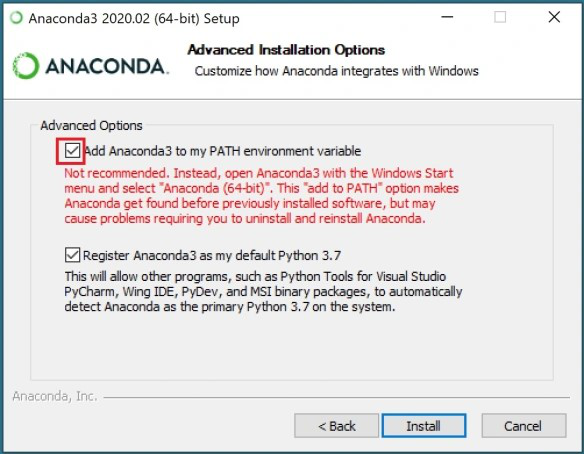

# Computer Infrastructure Assessment Repository


## Table of Contents

1. [About This Repository](#about-this-repository)
2. [Repository Contents](#repository-contents)
3. [Tasks Overview](#tasks-overview)
4. [Project Overview](#project-overview)
5. [Setting Up Your Environment](#setting-up-your-environment)
6. [Using the Repository](#using-the-repository)
7. [Need Help?](#need-help)
8. [Author](#author)

---

## About This Repository

This repository contains the assessment components for the Computer Infrastructure module. The assessment consists of three overlapping parts:

1. A series of tasks.
2. A small project.
3. A presentation/report component.

---

## Repository Contents

This repository includes the following:

- `.github/workflows/`: Directory containing GitHub Actions workflow files for automation.
- `data/`: Directory containing subdirectories `timestamps/` and `weather/` for managing timestamp and weather data.
- `img/`: Directory containing image files used in the repository.
- `.gitignore`: A file is used to specify which files and directories should be excluded from version control.
- `README.md`: A file provides an overview of the project, its purpose, and instructions for setup and usage.
- `requirements.txt`: Dependencies needed to run the Jupyter Notebook.
- `weather.ipynb`: A Jupyter Notebook serving as both a report on key realizations and a tool for data analysis.
- `weather.sh`: A Bash script to automate weather data downloads.

---

## Tasks Overview

The tasks involve working with the command line, scripting, and Git to automate a `weather.sh` script. Below is a list of specific tasks:

1. **Create Directory Structure:**
   Using the command line, create a directory (in other words, a folder) named data at the root of your repository. Inside data, create two subdirectories: timestamps and weather.

2. **Timestamps:**
   Navigate to the data/timestamps directory. Use the date command to output the current date and time, appending the output to a file named now.txt. Make sure to use the >> operator to append (not overwrite) the file. Repeat this step ten times, then use the more command to verify that now.txt has the expected content.
 
3. **Formatting Timestamps:**
   Run the date command again, but this time format the output using YYYYmmdd_HHMMSS (e.g., 20261114_130003 for 1:00:03 PM on November 14, 2026). Refer to the date man page (using man date) for more formatting options. (Press q to exit the man page). Append the formatted output to a file named formatted.txt.

4. **Create Timestamped Files:**
   Use the touch command to create an empty file with a name in the YYYYmmdd_HHMMSS.txt format. You can achieve this by embedding our date command in backticks (`) into the touch command. You should no longer use redirection (>>) in this step.

5. **Download Today's Weather Data:**
   Change to the data/weather directory. Download the latest weather data for the Athenry weather station from Met Eireann using wget. Use the -O <filename> option to save the file as weather.json. The data can be found at this URL: https://prodapi.metweb.ie/observations/athenry/today.

6. **Timestamp the Data:**
   Modify the command from Task 5 to save the downloaded file with a timestamped name in the format YYYYmmdd_HHMMSS.json.

7. **Write the Script:**
   Write a bash script called weather.sh in the root of your repository. This script should automate the process from Task 6, saving the weather data to the data/weather directory. Make the script executable and test it by running it.

8. **Notebook:**
   Create a notebook called weather.ipynb at the root of your repository. Write a brief report explaining how you completed Tasks 1 to 7 in this notebook. Provide short descriptions of the commands used in each task and explain their role in achieving them.

9. **Analyse Data with Pandas:**
   In your weather.ipynb notebook, use the pandas function read_json() to load in anyone of the weather data files you have downloaded with your script. Examine and summarise the data. Use the information provided by data.gov.ie to explain what the data set contains briefly.

---

## Project Overview

The project focuses on automating weather data workflows using GitHub Actions. Key steps:

1. **Create a GitHub Actions Workflow:**
   In your repository, create a folder called .github/workflows/ (if it doesn't already exist). Inside this folder, create a file called weather-data.yml. This file will define the GitHub Actions workflow.

2. **Run Daily at 10 am:**
   Use the schedule event with cron to set the script to run once a day at 10 a.m. Include the workflow_dispatch event to test the workflow.

3. **Use a Linux Virtual Machine:**
   In the workflow file, specify that a Ubuntu virtual machine should be used to run the action.

4. **Clone the Repository:**
   Have the workflow clone your repository.

5. **Execute the weather.sh script:**
   Add a step that runs your weather.sh script.

6. **Commit and Push changes back to the repository:**
   configure the workflow to commit the new weather data and push those changes back to your repository.

7. **Test the Workflow:**
   Check the logs in GitHub to ensure that the weather.sh script runs correctly, that new data is being committed.

---

## Setting Up Your Environment

### Prerequisites

- Python 3.8+
- Anaconda
- Bash shell
- Git

### Dependencies

Dependencies are essential for ensuring the proper functioning of this repository. In this project, the dependencies have been kept minimal to streamline the setup process and avoid unnecessary complexity. The only library included is Pandas, which is used for data manipulation in the Jupyter Notebook. It allows for the efficient handling and analysis of weather data downloaded by the weather.sh script.

### Installation Steps

1. Install Anaconda: 
    - Download the Anaconda distribution for your operating system from the official Anaconda website: https://www.anaconda.com/products/individual
    - Follow the installation instructions provided on the website. 
      During installation, MAKE SURE you check the two checkboxes
       * Add to PATH variable
       * Make this version your default Python



2. Install Git:
    - Download Git for your operating system from the official Git website: https://git-scm.com/downloads
    - Follow the installation instructions provided on the website.

3. Configure Git:
    - Open a terminal or Git Bash.
    - Set your name and email address using the following commands:
      ```
      git config --global user.name "Your Name"
      git config --global user.email "your.email@example.com"
      ```

4. Install Visual Studio Code (VS Code):
    - Download Visual Studio Code for your operating system from the official VS Code website: https://code.visualstudio.com/download
    - Follow the installation instructions provided on the website.

5. Clone the Repository:
   ```bash
   git clone https://github.com/TomUszyn/computer-infrastructure.git
   ```

5. Install Dependencies:
   ```bash
   pip install -r requirements.txt
   ```

---

## Using the Repository

### Running the Bash Script

1. Ensure `weather.sh` is executable:
   ```bash
   chmod +x weather.sh
   ```
2. Run the script:
   ```bash
   ./weather.sh
   ```

### Exploring the Jupyter Notebook

The `weather.ipynb` notebook serves dual purposes:

1. **Reporting:** Documenting the realization of key tasks.
2. **Data Analysis:** Examine and summarize the weather data with Pandas.

Make sure you have a Python environment with Jupyter installed. If not, you can install it by running:
```bash
pip install notebook
```

To open the notebook:
```bash
jupyter notebook weather.ipynb
```
VS Code open:

* Go to File > Open Folder, and select the cloned project directory where the weather.ipynb file is located.

* Select the Anaconda Environment in VS Code:

    - In the top-right corner of the notebook interface, click on the kernel selector. This will open a list of available Python environments.

    - Choose the Anaconda environment that has Jupyter installed. If you created a custom environment using conda, it will appear in this list.

   Once you select the correct environment, the kernel should switch to that environment, and you'll be ready to run the notebook.

* Click on weather.ipynb to open it. VS Code will automatically detect that it's a Jupyter notebook and will open it in the notebook interface.

* To execute the notebook:

    * Click on the first cell of the notebook.
    * Press Shift + Enter or click the Run button (a play icon) located on the left side of the cell to run it.
    * Continue running the remaining cells in the notebook by clicking the Run button for each cell, or press Shift + Enter to run them sequentially.
    * You can also select Run All from the Cell menu at the top to execute all cells at once.

In VS Code, "Restart Kernel and Run All" (via Ctrl + Shift + P → Jupyter: Restart Kernel and Run All) restarts the kernel and runs all cells from the beginning, ensuring a clean state and that all dependencies are properly reloaded.   

---

## Need Help?

If you have any questions, feel free to reach out. 

- **Email:** [tomaszuszynski3@gmail.com](mailto:tomaszuszynski3@gmail.com)

---

## Author

**Tomasz Uszynski**

I am an Atlantic Technical University in Ireland student pursuing a Higher Diploma in Science in Computing (Data Analytics). My technical expertise includes:

- **Operating Systems:** Proficient in Windows and Linux (especially Ubuntu).
- **Programming:** Skilled in Python for data analysis.
- **Databases:** Familiar with MySQL.
- **Web Technologies:** Basic knowledge of Apache.
- **Scripting:** Experienced in Bash scripting and YAML for automation and configuration.

I’m passionate about analysing datasets to derive insights and develop data-driven solutions.


